# pdi

Usage:
python indexExtractor -i list.txt -f [filterType] -o outputdir

Where the list.txt must have the img and the ground truth in the same line.

[filterType]:

0 -> No filter

1 -> Blur

2 -> Gaussian filter

3 -> Mean filter

4 -> Bilateral filter

No filter results
-------------
|Method|AUC|EER|FAR|FRR|Accuracy|
|:----------:|:-------------:|:------:|:------:|:------:|:------:|
|NGRDI|0.834|0.285|0.261|0.260|0.739|
|ExG|0.802|0.224|0.288|0.288|0.712|
|CIVE|0.856|0.576|0.224|0.224|0.776|
|VEG|0.798|0.193|0.285|0.285|0.715|
|ExGR|0.826|0.226|0.266|0.266|0.734|
|WI|0.797|0.425|0.264|0.264|0.736|

-------------
|Method|AUC|EER|FAR|FRR|Accuracy|
|:----------:|:-------------:|:------:|:------:|:------:|:------:|
|Arithmetic Mean|0.857|0.325|0.230|0.230|0.770|
|Geometric mean|0.852|0.008|0.235|0.235|0.765|

-------------
|Method|Accuracy|
|:----------:|:-------------:|
|Majority|0.740|

Blur results
-------------
|Method|AUC|EER|FAR|FRR|Accuracy|
|:----------:|:-------------:|:------:|:------:|:------:|:------:|
|NGRDI|0.899|0.386|0.190|0.190|0.810|
|ExG|0.858|0.314|0.236|0.236|0.764|
|CIVE|0.882|0.604|0.198|0.198|0.802|
|VEG|0.855|0.288|0.240|0.240|0.760|
|ExGR|0.889|0.326|0.201|0.201|0.799|
|WI|0.817|0.428|0.256|0.256|0.744|

-------------
|Method|AUC|EER|FAR|FRR|Accuracy|
|:----------:|:-------------:|:------:|:------:|:------:|:------:|
|Arithmetic Mean|0.894|0.395|0.197|0.197|0.803|
|Geometric mean|0.893|0.067|0.198|0.198|0.802|

-------------
|Method|Accuracy|
|:----------:|:-------------:|
|Majority|0.778|

Gaussian filter results
-------------
|Method|AUC|EER|FAR|FRR|Accuracy|
|:----------:|:-------------:|:------:|:------:|:------:|:------:|
|NGRDI|0.879|0.349|0.210|0.210|0.790|
|ExG|0.837|0.284|0.254|0.254|0.746|
|CIVE|0.877|0.597|0.205|0.205|0.795|
|VEG|0.836|0.257|0.256|0.256|0.744|
|ExGR|0.865|0.288|0.226|0.226|0.774|
|WI|0.803|0.421|0.264|0.264|0.736|

-------------
|Method|AUC|EER|FAR|FRR|Accuracy|
|:----------:|:-------------:|:------:|:------:|:------:|:------:|
|Arithmetic Mean|0.879|0.371|0.210|0.210|0.790|
|Geometric mean|0.877|0.035|0.211|0.211|0.789|

-------------
|Method|Accuracy|
|:----------:|:-------------:|
|Majority|0.763|

Mean filter results
-------------
|Method|AUC|EER|FAR|FRR|Accuracy|
|:----------:|:-------------:|:------:|:------:|:------:|:------:|
|NGRDI|0.889|0.387|0.202|0.202|0.798|
|ExG|0.834|0.302|0.263|0.263|0.737|
|CIVE|0.891|0.604|0.193|0.193|0.807|
|VEG|0.814|0.268|0.282|0.282|0.718|
|ExGR|0.865|0.319|0.231|0.231|0.769|
|WI|0.805|0.429|0.267|0.267|0.733|

-------------
|Method|AUC|EER|FAR|FRR|Accuracy|
|:----------:|:-------------:|:------:|:------:|:------:|:------:|
|Arithmetic Mean|0.881|0.390|0.214|0.214|0.786|
|Geometric mean|0.879|0.057|0.215|0.215|0.785|

-------------
|Method|Accuracy|
|:----------:|:-------------:|
|Majority|0.758|

Bilateral filter results
-------------
|Method|AUC|EER|FAR|FRR|Accuracy|
|:----------:|:-------------:|:------:|:------:|:------:|:------:|
|NGRDI|0.839|0.289|0.256|0.256|0.744|
|ExG|0.806|0.231|0.285|0.285|0.715|
|CIVE|0.870|0.588|0.213|0.213|0.787|
|VEG|0.795|0.203|0.291|0.291|0.709|
|ExGR|0.827|0.230|0.267|0.267|0.733|
|WI|0.796|0.419|0.266|0.266|0.734|

-------------
|Method|AUC|EER|FAR|FRR|Accuracy|
|:----------:|:-------------:|:------:|:------:|:------:|:------:|
|Arithmetic Mean|0.862|0.331|0.226|0.226|0.774|
|Geometric mean|0.856|0.010|0.232|0.232|0.768|

-------------
|Method|Accuracy|
|:----------:|:-------------:|
|Majority|0.739|

| Original | Early Fusion |
|:-------------------------:|:-------------------------:|
|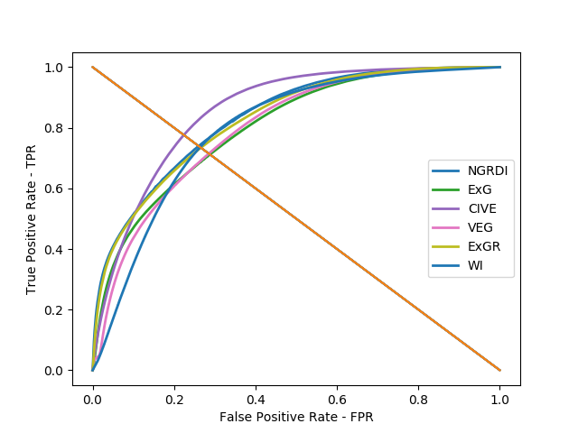 | |

| Blur | Early Fusion |
|:-------------------------:|:-------------------------:|
| |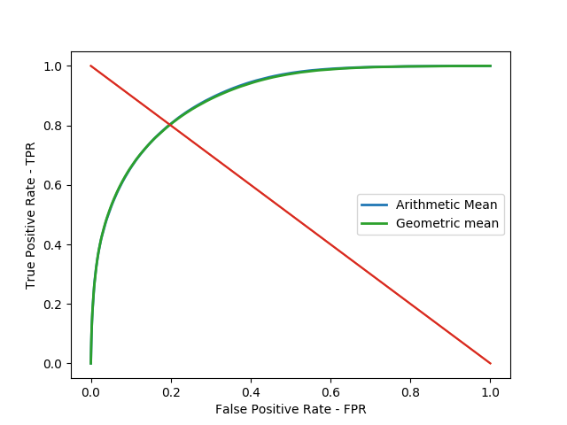 |

| Gaussian | Early Fusion |
|:-------------------------:|:-------------------------:|
| | |

| Mean | Early Fusion |
|:-------------------------:|:-------------------------:|
| | |

| Bilateral | Early Fusion |
|:-------------------------:|:-------------------------:|
|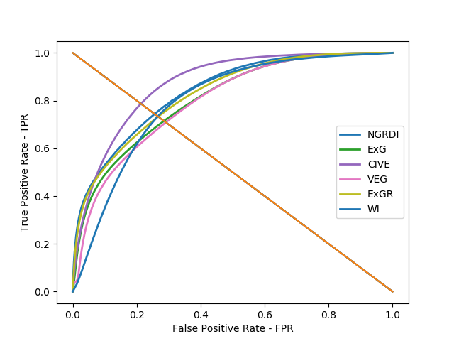 | |

------------------

Database LCRS2
-------------------

No filter results
-------------
|Method|AUC|EER|FAR|FRR|Accuracy|
|:----------:|:-------------:|:------:|:------:|:------:|:------:|
|NGRDI|0.790|0.428|0.290|0.290|0.710|
|ExG|0.801|0.311|0.268|0.268|0.732|
|CIVE|0.838|0.559|0.236|0.236|0.764|
|VEG|0.783|0.274|0.289|0.289|0.711|
|ExGR|0.777|0.374|0.302|0.302|0.698|
|WI|0.835|0.399|0.231|0.231|0.769|

|Method|AUC|EER|FAR|FRR|Accuracy|
|:----------:|:-------------:|:------:|:------:|:------:|:------:|
|Arithmetic Mean|0.842|0.391|0.241|0.241|0.759|
|Geometric mean|0.839|0.058|0.244|0.244|0.756|

|Method|Accuracy|
|:----------:|:-------------:|
|Majority|0.751|

Blur results
-------------
|Method|AUC|EER|FAR|FRR|Accuracy|
|:----------:|:-------------:|:------:|:------:|:------:|:------:|
|NGRDI|0.865|0.509|0.209|0.209|0.791|
|ExG|0.861|0.388|0.215|0.215|0.785|
|CIVE|0.853|0.573|0.220|0.220|0.780|
|VEG|0.853|0.367|0.225|0.225|0.775|
|ExGR|0.860|0.462|0.212|0.212|0.788|
|WI|0.813|0.418|0.252|0.252|0.748|

|Method|AUC|EER|FAR|FRR|Accuracy|
|:----------:|:-------------:|:------:|:------:|:------:|:------:|
|Arithmetic Mean|0.881|0.457|0.193|0.193|0.807|
|Geometric mean|0.882|0.261|0.193|0.193|0.807|

|Method|Accuracy|
|:----------:|:-------------:|
|Majority|0.801|

Gaussian filter results
-------------
|Method|AUC|EER|FAR|FRR|Accuracy|
|:----------:|:-------------:|:------:|:------:|:------:|:------:|
|NGRDI|0.849|0.480|0.232|0.232|0.768|
|ExG|0.849|0.361|0.230|0.230|0.770|
|CIVE|0.848|0.573|0.225|0.225|0.775|
|VEG|0.840|0.338|0.238|0.238|0.762|
|ExGR|0.840|0.432|0.240|0.240|0.760|
|WI|0.820|0.409|0.247|0.247|0.753|

|Method|AUC|EER|FAR|FRR|Accuracy|
|:----------:|:-------------:|:------:|:------:|:------:|:------:|
|Arithmetic Mean|0.874|0.436|0.204|0.204|0.796|
|Geometric mean|0.874|0.169|0.204|0.204|0.796|

|Method|Accuracy|
|:----------:|:-------------:|
|Majority|0.789|

Mean filter results
-------------
|Method|AUC|EER|FAR|FRR|Accuracy|
|:----------:|:-------------:|:------:|:------:|:------:|:------:|
|NGRDI|0.859|0.502|0.215|0.215|0.785|
|ExG|0.852|0.391|0.224|0.224|0.776|
|CIVE|0.851|0.584|0.223|0.223|0.777|
|VEG|0.838|0.362|0.238|0.238|0.762|
|ExGR|0.845|0.454|0.226|0.226|0.774|
|WI|0.826|0.426|0.240|0.240|0.760|

|Method|AUC|EER|FAR|FRR|Accuracy|
|:----------:|:-------------:|:------:|:------:|:------:|:------:|
|Arithmetic Mean|0.876|0.456|0.199|0.199|0.801|
|Geometric mean|0.876|0.255|0.199|0.199|0.801|

|Method|Accuracy|
|:----------:|:-------------:|
|Majority|0.796|

Bilateral filter results
-------------
|Method|AUC|EER|FAR|FRR|Accuracy|
|:----------:|:-------------:|:------:|:------:|:------:|:------:|
|NGRDI|0.806|0.437|0.280|0.280|0.720|
|ExG|0.813|0.322|0.262|0.262|0.738|
|CIVE|0.843|0.567|0.230|0.230|0.770|
|VEG|0.796|0.288|0.282|0.282|0.718|
|ExGR|0.793|0.380|0.293|0.293|0.707|
|WI|0.830|0.399|0.239|0.239|0.761|

|Method|AUC|EER|FAR|FRR|Accuracy|
|:----------:|:-------------:|:------:|:------:|:------:|:------:|
|Arithmetic Mean|0.850|0.401|0.235|0.235|0.765|
|Geometric mean|0.847|0.074|0.237|0.237|0.763|

|Method|Accuracy|
|:----------:|:-------------:|
|Majority|0.756|

| Original | Early Fusion |
|:-------------------------:|:-------------------------:|
| |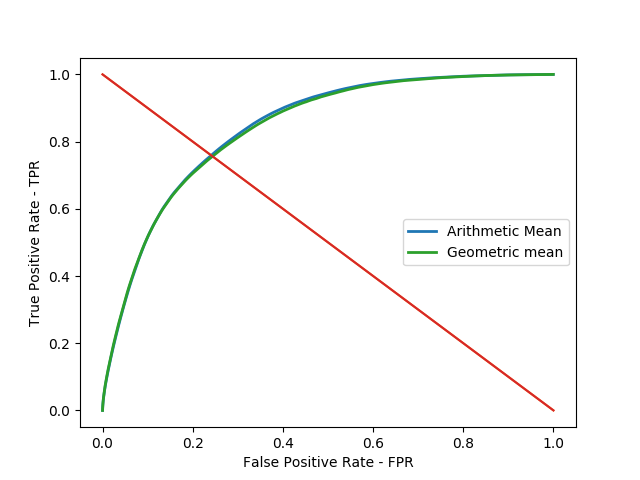 |

| Blur | Early Fusion |
|:-------------------------:|:-------------------------:|
| | |

| Gaussian | Early Fusion |
|:-------------------------:|:-------------------------:|
| | |

| Mean | Early Fusion |
|:-------------------------:|:-------------------------:|
| | |

| Bilateral | Early Fusion |
|:-------------------------:|:-------------------------:|
| |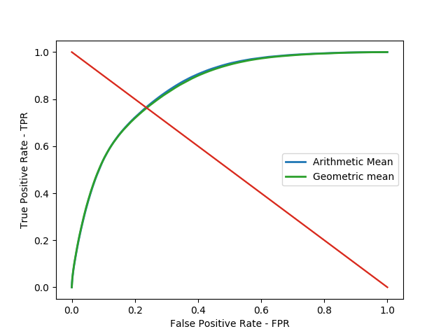 |

-----------------

Indices comparison blurred input
-------------------

|Original         | 
|:-------------------------:|
|  |

| NGRDI | CIVE | ExG |
|:-------------------------:|:-------------------------:|:-------------------------:|
| | | |

| ExGR | VEG | WI |
|:-------------------------:|:-------------------------:|:-------------------------:|
| | | | 

Database 1 - Individual sample analysis
-------------
||Mean|Standard deviation|
|:----------:|:-------------:|:------:|
|AUC|0.9528|0.02942|
|Accuracy|0.891429|0.042455|

Database 2 - Individual sample analysis
-------------
||Mean|Standard deviation|
|:----------:|:-------------:|:------:|
|AUC|0.912412|0.055023|
|Accuracy|0.848118|0.061750|

BoxPlot
-------------

|Data|NGRDI|NGRDI + Blur |CIVE|CIVE + Blur|
|:----------:|:----------:|:----------:|:----------:|:----------:|
|AUC|||||
|EER|||||
|AUC||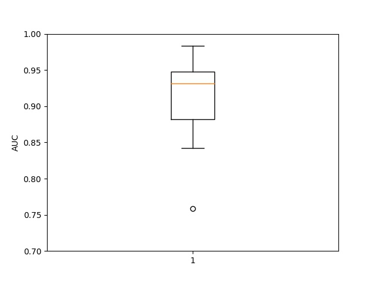|||
|EER|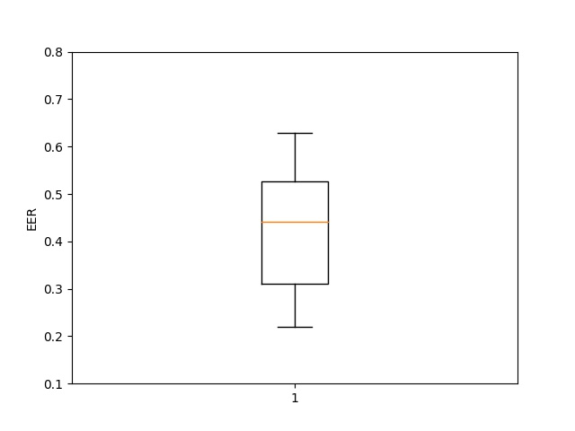|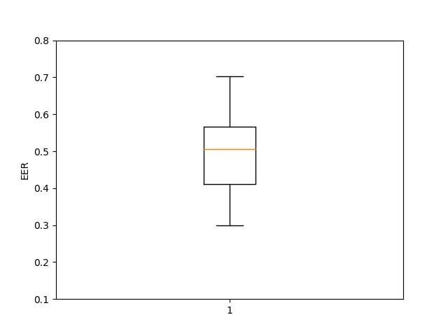|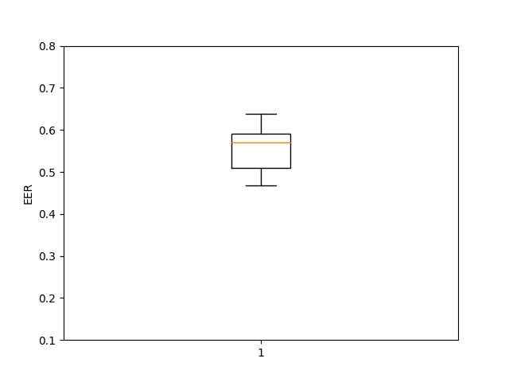|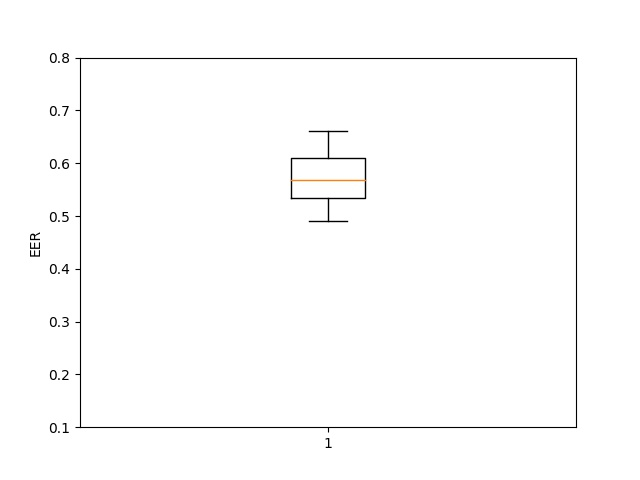|

Best and worst result
-------------
|NGRDI|NGRDI + Blur|CIVE|CIVE + Blur|
|:----------:|:----------:|:----------:|:----------:|
|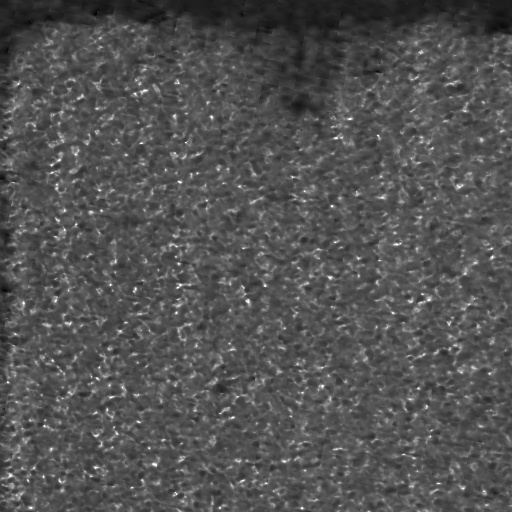||||
|||||