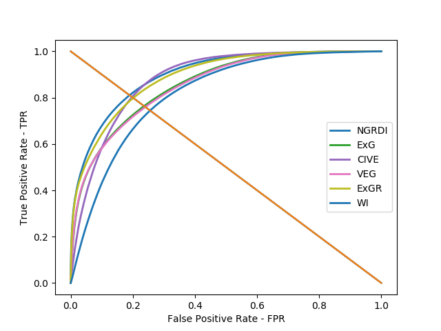
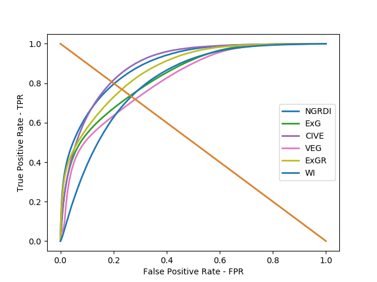
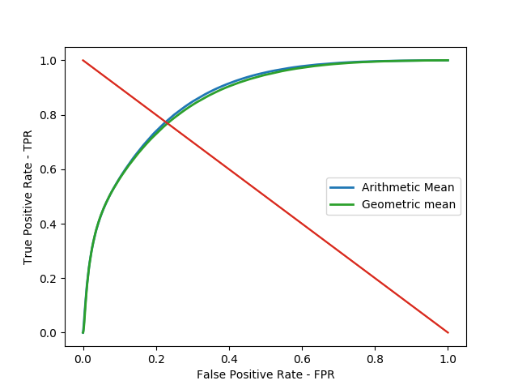
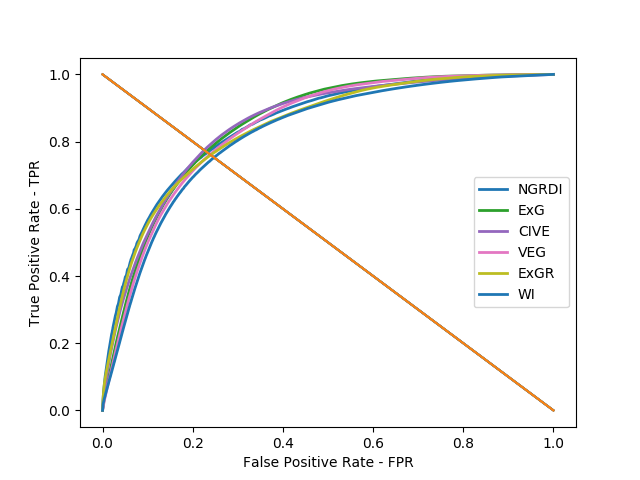
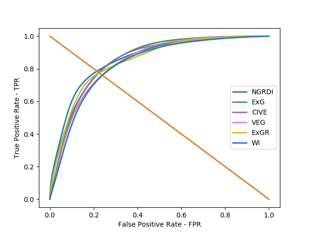
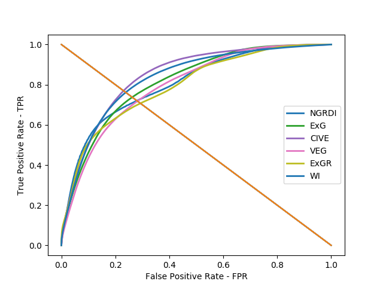

# pdi

Usage:
python indexExtractor -i list.txt -f [filterType] -o outputdir

Where the list.txt must have the img and the ground truth in the same line.

[filterType]:

0 -> No filter

1 -> Blur

2 -> Gaussian filter

3 -> Mean filter

4 -> Bilateral filter

No filter results
-------------

|Method|AUC|EER|FAR|FRR|Accuracy|
|:----------:|:-------------:|:------:|:------:|:------:|:------:|
|NGRDI|0.824|0.286|0.267|0.267|0.733|
|ExG|0.805|0.220|0.280|0.280|0.720|
|CIVE|0.845|0.579|0.237|0.237|0.763|
|VEG|0.814|0.187|0.269|0.269|0.731|
|ExGR|0.816|0.227|0.273|0.273|0.727|
|WI|0.783|0.427|0.278|0.278|0.722|

|Method|AUC|EER|FAR|FRR|Accuracy|
|:----------:|:-------------:|:------:|:------:|:------:|:------:|
|Arithmetic Mean|0.851|0.325|0.235|0.235|0.765|
|Geometric mean|0.846|0.008|0.239|0.239|0.761|

|Method|Accuracy|
|:----------:|:-------------:|
|Majority|0.737|

Blur results
-------------
|Method|AUC|EER|FAR|FRR|Accuracy|
|:----------:|:-------------:|:------:|:------:|:------:|:------:|
|NGRDI|0.890|0.389|0.199|0.199|0.801|
|ExG|0.852|0.313|0.243|0.243|0.757|
|CIVE|0.872|0.608|0.209|0.209|0.791|
|VEG|0.851|0.287|0.246|0.246|0.754|
|ExGR|0.878|0.328|0.214|0.214|0.786|
|WI|0.806|0.429|0.265|0.265|0.735|

|Method|AUC|EER|FAR|FRR|Accuracy|
|:----------:|:-------------:|:------:|:------:|:------:|:------:|
|Arithmetic Mean|0.884|0.397|0.209|0.209|0.791|
|Geometric mean|0.883|0.071|0.210|0.210|0.790|

|Method|Accuracy|
|:----------:|:-------------:|
|Majority|0.767|

Gaussian filter results
-------------
|Method|AUC|EER|FAR|FRR|Accuracy|
|:----------:|:-------------:|:------:|:------:|:------:|:------:|
|NGRDI|0.867|0.352|0.223|0.223|0.777|
|ExG|0.834|0.281|0.257|0.257|0.743|
|CIVE|0.867|0.599|0.216|0.216|0.784|
|VEG|0.834|0.255|0.257|0.257|0.743|
|ExGR|0.852|0.291|0.239|0.239|0.761|
|WI|0.795|0.421|0.271|0.271|0.729|

|Method|AUC|EER|FAR|FRR|Accuracy|
|:----------:|:-------------:|:------:|:------:|:------:|:------:|
|Arithmetic Mean|0.870|0.373|0.221|0.221|0.779|
|Geometric mean|0.868|0.036|0.222|0.222|0.778|

|Method|Accuracy|
|:----------:|:-------------:|
|Majority|0.753|

Mean filter results
-------------
|Method|AUC|EER|FAR|FRR|Accuracy|
|:----------:|:-------------:|:------:|:------:|:------:|:------:|
|NGRDI|0.876|0.390|0.216|0.216|0.784|
|ExG|0.830|0.301|0.270|0.270|0.730|
|CIVE|0.884|0.606|0.202|0.202|0.798|
|VEG|0.818|0.265|0.283|0.283|0.717|
|ExGR|0.852|0.324|0.246|0.246|0.754|
|WI|0.796|0.429|0.274|0.274|0.726|

|Method|AUC|EER|FAR|FRR|Accuracy|
|:----------:|:-------------:|:------:|:------:|:------:|:------:|
|Arithmetic Mean|0.870|0.391|0.226|0.226|0.774|
|Geometric mean|0.868|0.059|0.227|0.227|0.773|

|Method|Accuracy|
|:----------:|:-------------:|
|Majority|0.744|

Bilateral filter results
-------------
|Method|AUC|EER|FAR|FRR|Accuracy|
|:----------:|:-------------:|:------:|:------:|:------:|:------:|
|NGRDI|0.829|0.290|0.264|0.264|0.736|
|ExG|0.809|0.227|0.278|0.278|0.722|
|CIVE|0.860|0.591|0.225|0.225|0.775|
|VEG|0.808|0.197|0.278|0.278|0.722|
|ExGR|0.817|0.231|0.274|0.274|0.726|
|WI|0.784|0.421|0.276|0.276|0.724|

|Method|AUC|EER|FAR|FRR|Accuracy|
|:----------:|:-------------:|:------:|:------:|:------:|:------:|
|Arithmetic Mean|0.856|0.331|0.232|0.232|0.768|
|Geometric mean|0.850|0.010|0.236|0.236|0.764|

|Method|Accuracy|
|:----------:|:-------------:|
|Majority|0.736|

| Original | Early Fusion |
|:-------------------------:|:-------------------------:|
| | |

| Blur | Early Fusion |
|:-------------------------:|:-------------------------:|
| | |

| Gaussian | Early Fusion |
|:-------------------------:|:-------------------------:|
| | |

| Mean | Early Fusion |
|:-------------------------:|:-------------------------:|
| | |

| Bilateral | Early Fusion |
|:-------------------------:|:-------------------------:|
| | |

------------------

Database LCRS2
-------------------

No filter results
-------------
|Method|AUC|EER|FAR|FRR|Accuracy|
|:----------:|:-------------:|:------:|:------:|:------:|:------:|
|NGRDI|0.790|0.428|0.290|0.290|0.710|
|ExG|0.801|0.311|0.268|0.268|0.732|
|CIVE|0.838|0.559|0.236|0.236|0.764|
|VEG|0.783|0.274|0.289|0.289|0.711|
|ExGR|0.777|0.374|0.302|0.302|0.698|
|WI|0.835|0.399|0.231|0.231|0.769|

|Method|AUC|EER|FAR|FRR|Accuracy|
|:----------:|:-------------:|:------:|:------:|:------:|:------:|
|Arithmetic Mean|0.842|0.391|0.241|0.241|0.759|
|Geometric mean|0.839|0.058|0.244|0.244|0.756|

|Method|Accuracy|
|:----------:|:-------------:|
|Majority|0.751|

Blur results
-------------
|Method|AUC|EER|FAR|FRR|Accuracy|
|:----------:|:-------------:|:------:|:------:|:------:|:------:|
|NGRDI|0.865|0.509|0.209|0.209|0.791|
|ExG|0.861|0.388|0.215|0.215|0.785|
|CIVE|0.853|0.573|0.220|0.220|0.780|
|VEG|0.853|0.367|0.225|0.225|0.775|
|ExGR|0.860|0.462|0.212|0.212|0.788|
|WI|0.813|0.418|0.252|0.252|0.748|

|Method|AUC|EER|FAR|FRR|Accuracy|
|:----------:|:-------------:|:------:|:------:|:------:|:------:|
|Arithmetic Mean|0.881|0.457|0.193|0.193|0.807|
|Geometric mean|0.882|0.261|0.193|0.193|0.807|

|Method|Accuracy|
|:----------:|:-------------:|
|Majority|0.801|

Gaussian filter results
-------------
|Method|AUC|EER|FAR|FRR|Accuracy|
|:----------:|:-------------:|:------:|:------:|:------:|:------:|
|NGRDI|0.849|0.480|0.232|0.232|0.768|
|ExG|0.849|0.361|0.230|0.230|0.770|
|CIVE|0.848|0.573|0.225|0.225|0.775|
|VEG|0.840|0.338|0.238|0.238|0.762|
|ExGR|0.840|0.432|0.240|0.240|0.760|
|WI|0.820|0.409|0.247|0.247|0.753|

|Method|AUC|EER|FAR|FRR|Accuracy|
|:----------:|:-------------:|:------:|:------:|:------:|:------:|
|Arithmetic Mean|0.874|0.436|0.204|0.204|0.796|
|Geometric mean|0.874|0.169|0.204|0.204|0.796|

|Method|Accuracy|
|:----------:|:-------------:|
|Majority|0.789|

Mean filter results
-------------
|Method|AUC|EER|FAR|FRR|Accuracy|
|:----------:|:-------------:|:------:|:------:|:------:|:------:|
|NGRDI|0.859|0.502|0.215|0.215|0.785|
|ExG|0.852|0.391|0.224|0.224|0.776|
|CIVE|0.851|0.584|0.223|0.223|0.777|
|VEG|0.838|0.362|0.238|0.238|0.762|
|ExGR|0.845|0.454|0.226|0.226|0.774|
|WI|0.826|0.426|0.240|0.240|0.760|

|Method|AUC|EER|FAR|FRR|Accuracy|
|:----------:|:-------------:|:------:|:------:|:------:|:------:|
|Arithmetic Mean|0.876|0.456|0.199|0.199|0.801|
|Geometric mean|0.876|0.255|0.199|0.199|0.801|

|Method|Accuracy|
|:----------:|:-------------:|
|Majority|0.796|

Bilateral filter results
-------------
|Method|AUC|EER|FAR|FRR|Accuracy|
|:----------:|:-------------:|:------:|:------:|:------:|:------:|
|NGRDI|0.806|0.437|0.280|0.280|0.720|
|ExG|0.813|0.322|0.262|0.262|0.738|
|CIVE|0.843|0.567|0.230|0.230|0.770|
|VEG|0.796|0.288|0.282|0.282|0.718|
|ExGR|0.793|0.380|0.293|0.293|0.707|
|WI|0.830|0.399|0.239|0.239|0.761|

|Method|AUC|EER|FAR|FRR|Accuracy|
|:----------:|:-------------:|:------:|:------:|:------:|:------:|
|Arithmetic Mean|0.850|0.401|0.235|0.235|0.765|
|Geometric mean|0.847|0.074|0.237|0.237|0.763|

|Method|Accuracy|
|:----------:|:-------------:|
|Majority|0.756|

| Original | Early Fusion |
|:-------------------------:|:-------------------------:|
| | |

| Blur | Early Fusion |
|:-------------------------:|:-------------------------:|
| | |

| Gaussian | Early Fusion |
|:-------------------------:|:-------------------------:|
| | |

| Mean | Early Fusion |
|:-------------------------:|:-------------------------:|
| | |

| Bilateral | Early Fusion |
|:-------------------------:|:-------------------------:|
| | |

-----------------

Indices comparison blurred input
-------------------

|Original         | 
|:-------------------------:|
|  |

| NGRDI | CIVE | ExG |
|:-------------------------:|:-------------------------:|:-------------------------:|
| | | |

| ExGR | VEG | WI |
|:-------------------------:|:-------------------------:|:-------------------------:|
| | | | 

Database 1 - Individual sample analysis
-------------
||Mean|Standard deviation|
|:----------:|:-------------:|:------:|
|AUC|0.9528|0.02942|
|Accuracy|0.891429|0.042455|

EER
0.332,0.266,0.330,0.315,0.285,0.313,0.243,0.263,0.367,0.450,0.374,0.366,0.398,0.211,0.256,0.453,0.441,0.496,0.457,0.549,0.446,0.432,0.450,0.418,0.336,0.465,0.411,0.478,0.412,0.428,0.460,0.325,0.435,0.512,0.468

Database 2 - Individual sample analysis
-------------
||Mean|Standard deviation|
|:----------:|:-------------:|:------:|
|AUC|0.912412|0.055023|
|Accuracy|0.848118|0.061750|

EER
0.396,0.415,0.506,0.411,0.300,0.356,0.441,0.344,0.492,0.547,0.535,0.567,0.595,0.515,0.702,0.601,0.644

BoxPlot
-------------

|Data|NGRDI|NGRDI + Blur |CIVE|CIVE + Blur|
|:----------:|:----------:|:----------:|:----------:|:----------:|
|AUC|||||
|EER|||||
|AUC|||||
|EER|||||

Best and worst result
-------------
|NGRDI|NGRDI + Blur|CIVE|CIVE + Blur|
|:----------:|:----------:|:----------:|:----------:|
|||||
|||||